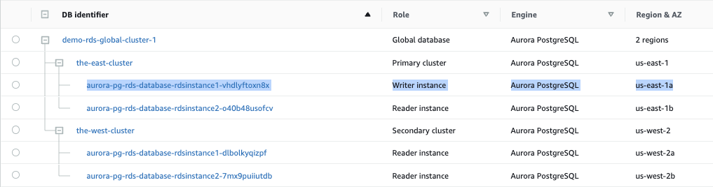
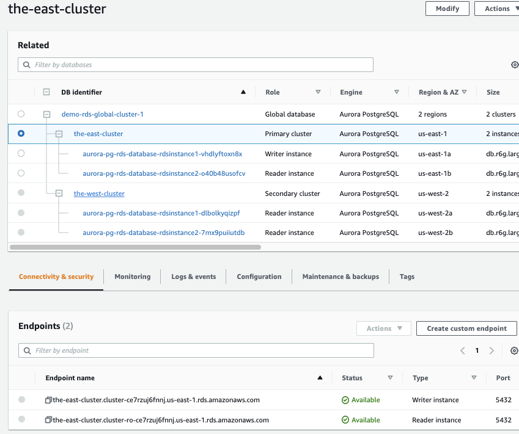
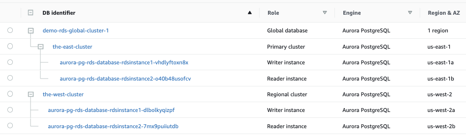

# How to Build the Multi Regional Aurora Postgres Global Database With an Automatic Failover and Fallback

Aurora Global Database supports managed planned failovers. You can manually invoke a process that promotes one of the existing secondary regions to be the new primary region. A managed planned failover, however, requires a healthy global database cluster.   

An unplanned event occurs when the primary region becomes unhealthy. Unfortunately, there is no AWS-orchestrated automated solution available to promote the secondary region and bring the database up and running. 

This project illustrates how to achieve this by building the RDS cluster in a certain way along with a series of Lambdas and a step function. 


  
### Step 1: (Build the stack-infra in both regions)

```{r chunk-name-with-no-spaces} 
aws cloudformation create-stack --stack-name aurora-pg-rds-infra --template-body file://stack-infra.yml --profile yourprofile --region us-east-1 --capabilities CAPABILITY_AUTO_EXPAND
aws cloudformation create-stack --stack-name aurora-pg-rds-infra --template-body file://stack-infra.yml --profile yourprofile --region us-west-2 --capabilities CAPABILITY_AUTO_EXPAND
 ```

#### This will create the following
1. A custom KMS Key for the Database encryption and Secret manager encryption. The ARN of the the KMS Key will be exported to a parameter store entry called /demo/rds/kmskey/arn
2. Secret Manager entries called 'theadmin' and  'theuser'. These secrets will be exported the parameter store (demo/rds/theadmin/secret and demo/rds/theuser/secret respectively)
3. A security group called 'LambdaSecurityGroup' for the Lambdas to manage 443 traffic. The value of the security group will be exported to a parameter store entry called /demo/rds/sg/lambda-security-group
4. A parameter store entry called '/demo/rds/global/cluster/name' to store the Global Cluster Name. We will be changing this value when we do a fallback after an unplanned failover.


### Step 2: (Build the stack-iam in both regions)
```{r chunk-name-with-no-spaces} 
aws cloudformation create-stack --stack-name aurora-pg-rds-iam --template-body file://stack-iam.yml --profile yourprofile --region us-east-1 --capabilities CAPABILITY_AUTO_EXPAND CAPABILITY_NAMED_IAM
aws cloudformation create-stack --stack-name aurora-pg-rds-iam --template-body file://stack-iam.yml --profile yourprofile --region us-west-2 --capabilities CAPABILITY_AUTO_EXPAND CAPABILITY_NAMED_IAM
 ```

#### This will create the following
1. An IAM role for all your Lambdas to connect to the database
2. The ARN of the IAM role will be exported a parameter store entry called /demo/rds/iam/lamdaexecutionrole

### Step 3: (Build the stack-db-west in us-west-2)
```{r chunk-name-with-no-spaces} 
aws cloudformation create-stack --stack-name aurora-pg-rds-database --template-body file://stack-db-west.yml --profile yourprofile --region us-west-2 --capabilities CAPABILITY_AUTO_EXPAND 
 ```

#### This will create the following
1. A global Cluster
2. Two instances of the database in the WEST where one of the instances will be a WRITER


### Step 4: (Build the stack-db-east in us-east-1)
```{r chunk-name-with-no-spaces} 
aws cloudformation create-stack --stack-name aurora-pg-rds-database --template-body file://stack-db-east.yml --profile yourprofile --region us-east-1 --capabilities CAPABILITY_AUTO_EXPAND 
 ```

#### This will create the following
1. A new cluster which will be added to the Global Cluster created in the West (above step)
2. Two READER instances of the database in the east  

  


### Step 5: (Planned Failover/Fallback and Unplanned Failover Lambdas)
```{r chunk-name-with-no-spaces} 
aws cloudformation create-stack --stack-name aurora-pg-rds-lambdas --template-body file://stack-lambdas.yml --profile yourprofile --region us-east-1 --capabilities CAPABILITY_AUTO_EXPAND 
aws cloudformation create-stack --stack-name aurora-pg-rds-lambdas --template-body file://stack-lambdas.yml --profile yourprofile --region us-west-2 --capabilities CAPABILITY_AUTO_EXPAND  
 ```

#### This will create the following
1. A lambda called 'demo-lambda-dev-rds-infra-planned-failover-2-east' to manually promote the East as the primary (Deployed to EAST only)
2. A lambda called 'demo-lambda-dev-rds-infra-planned-failover-2-west' to manually promote the West as the primary (Deployed to WEST only)
3. A lambda called 'demo-lambda-dev-rds-infra-detach-and-promote-west' to handle an Unplanned Failover event (Deployed to WEST only)


### Step 6: (Do a Planned Failover to the East and make the East Primary)
1. Fail the global cluster to East to flip the writer from West to East by invoking the lambda as follows
```{r chunk-name-with-no-spaces} 
aws lambda invoke --function-name arn:aws:lambda:us-east-1:{accountid}:function:demo-lambda-dev-rds-infra-planned-failover-2-east --region us-east-1  --log-type Tail ~/lambda.log 
 ```    
2. Once the failover is complete, your application can use the East end point to connect to the database

  

Now the database is all ready and your applications can start to read/write via the appropriate end points as shown below

  


### Step 7: (Unplanned Failover )

I will leave it up to your imagination how to mark the primary region database instance as unhealthy. The following is just to give you an idea.
1. Have an "event rule" trigger a lamdba, which connects to the writer to do an update operation  
2. If you get 3 consecutive errors, you can assume that the db instance is unresponsive and it is time to failover to the West  
3. Once you mark the primary as unhealthy, you can start the failover process by invoking the lambda "demo-lambda-dev-rds-infra-detach-and-promote-west" from your event rule lambda
 ```{r chunk-name-with-no-spaces} 
    aws lambda invoke --function-name arn:aws:lambda:us-west-2:{accountid}:function:demo-lambda-dev-rds-infra-detach-and-promote-west --profile yourprofile --region us-west-2 --log-type Tail ~/lambda.log
 ```  
I would suggest using a 'Step Function' if you have more than one lambdas to trigger. For example, if you are using Route53 CNAMEs for your writer/reader endpoints, it is better to detach first, and then update the CNAMES. If you have containerized (ECS for example) applications with database connectivity, it is recommended to restart ECS tasks after the Route53 change to avoid any possibility of IP caching. This can be a third lambda for your step function.

The end result will be the following (a standalone database in the WEST with a READ and WRITE end point).

  

### Step 8: (Fallback to East)
Once the East region recovers from the distaster, it is time to fallback and make the East the primary agian. Here is what you need to do. 

1. Delete the East Stack (do it from the cloudformation)
2. Change the name of the global cluster from the parameter store (/demo/rds/global/cluster/name). For example, change 'demo-global-cluster-1' to 'demo-global-cluster-2'
3. Update the West Cloudformation stack
aws cloudformation update-stack --stack-name aurora-pg-rds-db --template-body file://stack-db-west.yml --profile yourprofile --region us-west-2 --capabilities CAPABILITY_AUTO_EXPAND 
 ```{r chunk-name-with-no-spaces} 
aws cloudformation create-stack --stack-name aurora-pg-rds-db --template-body file://stack-db-east.yml --profile yourprofile --region us-east-1 --capabilities CAPABILITY_AUTO_EXPAND 
 ```  
4. Recreate the East CloudFormation stack
5. Repeat Step 6:
