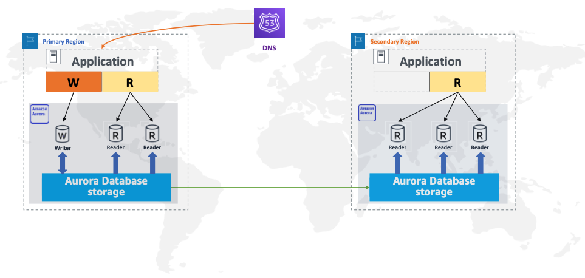
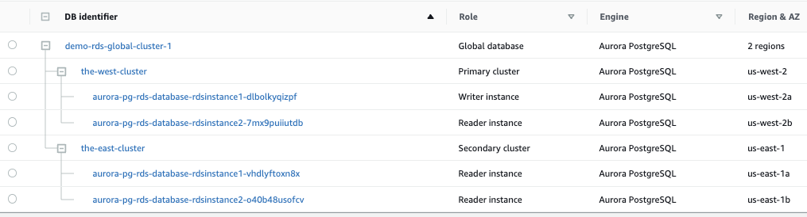

# How to Build the Multi Regional Aurora Postgres Global Database With an Automatic Failover and Fallback

Aurora Global Database supports managed planned failovers, you can manually invoke a process that promotes one of the existing secondary regions to be the new primary region. A managed planned failover, however, requires a healthy global database cluster.   

An unplanned event occurs when the primary region becomes unhealthy. Unfortunately, there is no AWS-orchestrated automated solution available to promote the secondary region and bring the database up and running. This project illustrates how to acheive this by building the RDS cluster in a certain way along with a series of Lambdas and a step function

  
  
### Step1 (Build the stack-infra in both regions)

1.  aws cloudformation create-stack --stack-name aurora-pg-rds-infra --template-body file://stack-infra.yml --profile saml --region us-east-1 --capabilities CAPABILITY_AUTO_EXPAND
2.  aws cloudformation create-stack --stack-name aurora-pg-rds-infra --template-body file://stack-infra.yml --profile saml --region us-west-2 --capabilities CAPABILITY_AUTO_EXPAND

#### This will create the following
1. A custom KMS Key for the Database encryption and Secret manager encryption. The ARN of the the KMS Key will be exported to a parameter store entry called /demo/rds/kmskey/arn
2. Secret Manager entries called 'theadmin' and  'theuser'. These secretes will be exported the parameter store (demo/rds/theadmin/secret and demo/rds/theuser/secret respectively)
3. A security group called 'LambdaSecurityGroup' for the Lambdas to manage 443 traffic. The value of the securify group will be exported a parameter store entry called /demo/rds/sg/lambda-security-group
4. A parameter store entry called '/demo/rds/global/cluster/name' to store the Gloabl Cluster Name. We will be changing this value when we do a fallback after an unplanned failover.

### Step2 (Build the stack-iam in both regions)

1.  aws cloudformation create-stack --stack-name aurora-pg-rds-iam --template-body file://stack-iam.yml --profile saml --region us-east-1 --capabilities CAPABILITY_AUTO_EXPAND CAPABILITY_NAMED_IAM
2.  aws cloudformation create-stack --stack-name aurora-pg-rds-iam --template-body file://stack-iam.yml --profile saml --region us-west-2 --capabilities CAPABILITY_AUTO_EXPAND CAPABILITY_NAMED_IAM

#### This will create the following
1. An IAM role for all your Lambdas to connect to the database
2. The ARN of the IAM role will be exported a parameter store entry called /demo/rds/iam/lamdaexecutionrole

### Step3 (Build the stack-db-west in us-west-2)

1.  aws cloudformation create-stack --stack-name aurora-pg-rds-database --template-body file://stack-db-west.yml --profile saml --region us-west-2 --capabilities CAPABILITY_AUTO_EXPAND 

#### This will create the following
1. A global Cluster
2. Two instances of the database in the WEST where one of the instances will be a WRITER

### Step4 (Build the stack-db-east in us-east-1)
1.  aws cloudformation create-stack --stack-name aurora-pg-rds-database --template-body file://stack-db-east.yml --profile saml --region us-east-1 --capabilities CAPABILITY_AUTO_EXPAND 

#### This will create the following
1. A new cluster which will be added to the Global Cluster created in the West (above step)
2. Two READER instances of the databae in the east  

  

### Step5 (Fail to East and make the East Primary)
1. Fail the global cluster to East to flip the writer from West to East (you can do it from the console or via a Lambda)
2. Once the failover is complete, your application can use the East end point to connect to the database

### Step5 (Detach and Promote West in the event of an East failure)
1. Use the detach and promote to make the West the primary (you can do it from the console or via a Lambda)
2. Once the detach is complete, your application can use the West end point to connect to the database
3. This will create a standalone database in the WEST and the replication between the regions will stop at this moment

### Step6 (Fallback to East)
1. Delete the East Stack (do it from the cloudformation)
2. Change the name of the global cluster from the parameter store (/demo/rds/global/cluster/name)
3. Update the West Cloudformation stack

aws cloudformation update-stack --stack-name aurora-pg-rds-db --template-body file://stack-db-west.yml --profile saml --region us-west-2 --capabilities CAPABILITY_AUTO_EXPAND 

4. Recreate the East CloudFormation stack

aws cloudformation create-stack --stack-name aurora-pg-rds-db --template-body file://stack-db-east.yml --profile saml --region us-east-1 --capabilities CAPABILITY_AUTO_EXPAND 

5. Once this is over, fail to East to make the East primary again
